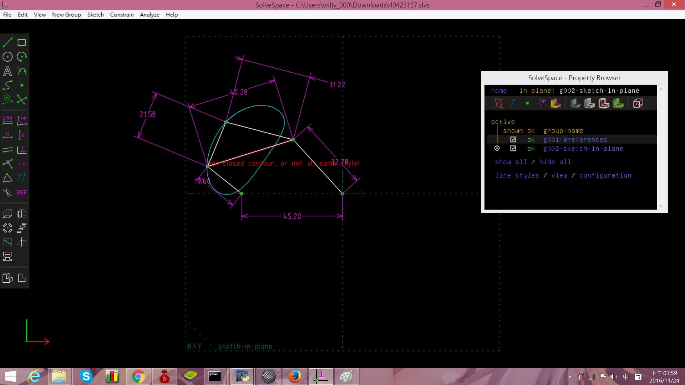
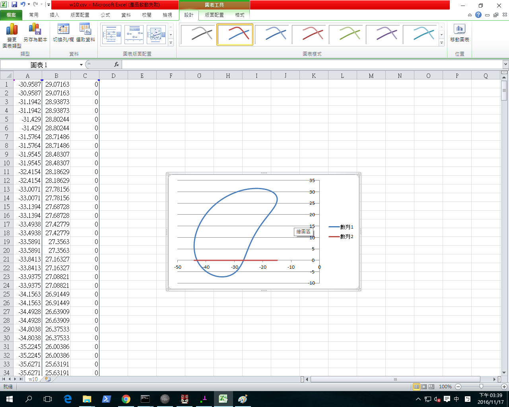

Title: 2016Fall  112 電腦輔助設計實習期末總結
Date: 2016-1-12 12:00
Category: hw
Tags: hw
Author: 40423157

<!-- PELICAN_END_SUMMARY -->

###零件繪製

<iframe src="https://player.vimeo.com/video/185629545" width="640" height="400" frameborder="0" webkitallowfullscreen mozallowfullscreen allowfullscreen></iframe>

<a href="https://vimeo.com/185629545">40423157設計二甲朱明棈</a> from <a href="https://vimeo.com/user57496043">40423157</a> on <a href="https://vimeo.com">Vimeo</a>.

###四連桿

Solvespace 四連桿圖

<a href="./../w7/40423157.csv"> w7.csv</a> (請以滑鼠右鍵存檔)

<a href="./../w7/40423157.slvs">w7.slvs</a> (請以滑鼠右鍵存檔)

###四連桿-2

<!-- 導入 brython.js -->

<!-- 啟動 brython() -->

<!-- 以下利用 Brython 程式執行繪圖 -->

<canvas id="fourbar" width="600" height="600"></canvas>

###solvespace練習

Extrude (平行長出或除料)

<iframe src="./../data/方塊.html" width="800"height="600"></iframe>

<iframe src="./../data/方塊挖洞.html" width="800"height="600"></iframe>

Lathe (旋轉繞行長出或除料)

<iframe src="./../data/40423157.html" width="800"height="600"></iframe>

Assembly (零件組立)

<iframe src="./../data/BOX.html" width="800"height="600"></iframe>

<iframe src="https://player.vimeo.com/video/199189827" width="640" height="345" frameborder="0" webkitallowfullscreen mozallowfullscreen allowfullscreen></iframe>

<a href="https://vimeo.com/199189827">2017-01-13 01-08-39</a> from <a href="https://vimeo.com/user57496043">40423157</a> on <a href="https://vimeo.com">Vimeo</a>.

###組合圖作業

<iframe src="./../data/1215.html" width="800"height="600"></iframe>

###3D印表機

零件

<iframe src="./../data/桿1.html" width="800"height="600"></iframe>
<iframe src="./../data/桿2.html" width="800"height="600"></iframe>
<iframe src="./../data/圓盤1.html" width="800"height="600"></iframe>
<iframe src="./../data/板1.html" width="800"height="600"></iframe>

3D印表機
<iframe src="./../data/3dd.html" width="800"height="600"></iframe>

<iframe src="https://player.vimeo.com/video/199168253" width="640" height="345" frameborder="0" webkitallowfullscreen mozallowfullscreen allowfullscreen></iframe>

<a href="https://vimeo.com/199168253">2017-01-12 22-50-55</a> from <a href="https://vimeo.com/user57496043">40423157</a> on <a href="https://vimeo.com">Vimeo</a>.

###Onshape零件組合

<iframe src="https://player.vimeo.com/video/199661455" width="640" height="337" frameborder="0" webkitallowfullscreen mozallowfullscreen allowfullscreen></iframe>

<a href="https://vimeo.com/199661455">2017-01-16 21-22-36</a> from <a href="https://vimeo.com/user57496043">40423157</a> on <a href="https://vimeo.com">Vimeo</a>.

